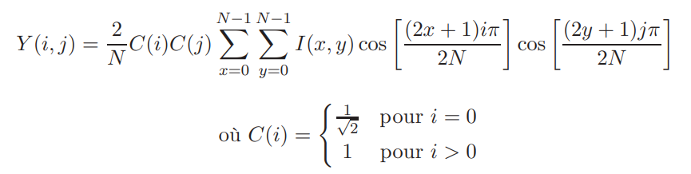

# Compte rendu - Théorie des codes - Codage JPEG

Date: November 1, 2022
Groupe: ABBOUD Oussama && OUMLIL Abdellah
Week: Week 1

## Structure du code:

- Fichier ***calcul.cpp:***
    - Opérations utiles pour l’encodage/décodage JPEG
        - Calcul DCT:
        
        
        
        Equation DCT
        
        ```cpp
        /*
        	Cette fonction calcul la transformée en cosinus discrète 
        	Paramètres : image de taille 8*8 pixels
        	Sortie : résultat DCT sur l'image 
        */
        CImg<float> DCT(CImg<float> & sub_image);
        ```
        
        - Calcul DCT Inverse:
        
        
        
        Equation DCT Inverse
        
        ```cpp
        /*
        	Cette fonction calcul la transformée en cosinus discrète inverse
        	Paramètres : image de taille 8*8 pixels
        	Sortie : résultat DCT Inverse sur l'image 
        */
        CImg<float> DCT_inverse(CImg<float> & image_encodee)
        ```
        
        - Encodage JPEG:
        
        
        
        ```cpp
        /*
        	Cette fonction réalise l'encodage JPEG sur l'image donnée en paramètre
        	Paramètres:
        					- Image à encoder
        					- Facteur qualité
        	Sortie: Image encodée
        */
        CImg<float> JPEGEncoder(CImg<float> image, float quality)
        ```
        
        - Décodage JPEG:
        
        
        
        ```cpp
        /*
        	Cette fonction réalise le décodage JPEG sur l'image donnée en paramètre
        	Paramètres:
        					- Image à décoder
        					- Facteur qualité
        	Sortie: Image décodée
        */
        CImg<float> JPEGDecoder(CImg<float> image, float quality)
        ```
        
        - Calcul de distorsion:
        
        ```cpp
        /*
        	Cette fonction calcul la distorsion
        	Paramètres:
        					- Image originale
        					- Image décodée
        	Sortie: distorsion
        */
        float distorsion(CImg<float> & original_image, CImg<float> & encoded_image)
        ```
        
- Résultats et Interprétations:
    - Encodage / Decodage:
    
    
    
    - Facteur de qualité allant de 1 à 5 avec un pas de 1:
    
    